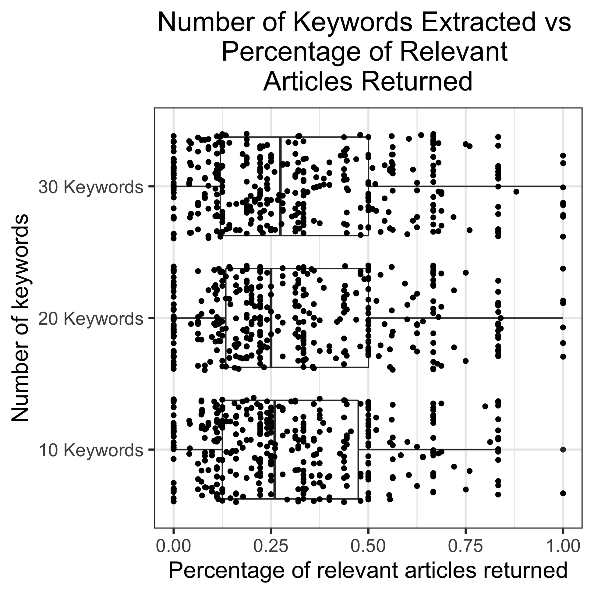

## Results {.page_break_before}
The two main techniques in this paper are keyword identification and word vector generation. Both of these methods are described below.

### Keyword Identification
Keyword extraction is a vital part of the analysis. There are a variety of techniques to achieve this, and we test the most common 9 
techniques in this paper. Each technique performs the analysis slightly differently and this leads to variation in the keywords identified. 
An example of the variation is shown below.

*Sample Abstract -> "BRCA1 and BRCA2 are the genes related with breast and ovarian cancer. They have function in DNA repair processes 
and thus they are tumor suppressor genes. There are hundreds of mutations identified in these genes. Functional deficiencies due to 
these mutations impair DNA repair and cause irregularities in the DNA synthesis. The standard method for the laboratory assessment of 
these BRCA genes includes comprehensive sequencing and testing of broad genomic rearrangements. Members of the families with BRCA mutations 
have an increased risk for early onset of breast cancer and ovarian cancer occurring at any age."*

| *Keyword Extraction Technique* | *Top 3 Keywords returned* |
|:-------------------------------|:-------------------------:|
| TopicRank                         | 'mutations', 'breast', 'dna repair processes'                               |
| TextRank                          | 'dna repair processes', 'tumor suppressor genes', 'serum ca-125 levels'     |
| SingleRank                        | 'brca mutations', 'brca genes', 'breast cancer'                             |
| TopicalPageRank                   | 'brca genes', 'brca mutations', 'tumor suppressor genes'                    |
| MultipartiteRank                  | 'mutations', 'genes', 'dna repair processes'                                |

### Word Vector Generation
Vector generation is how similarities between articles are calculated. This allows us to give a numerical percentage to quantify the relationship
between two datasets. In our analysis we test 6 models that can generate vectors. Each model is trained on unique text and will yield slightly different
word vectors. This in turn will generate slightly different cosine similarities. An example of vector generation is shown below:

| *Word* | *Vector* |
|:-------|:--------:|
| Database | [ 1.3863622   1.0939984  -2.1352     -1.9841313  -0.31141075  1.3959851 ... ]  |
| Gene     | [ 1.4969006   2.7855976  -4.313326   -2.5572329  -0.9275282   0.43499815 ... ] |
| Mutation | [ 2.7130241e+00  2.5561374e-01 -2.1098554e+00 -2.1719341e+00 ... ]             |
| Disease  | [ 1.9606729e+00  3.5872436e-01 -2.9315462e+00 -2.3048987e+00 ... ]             |

### Evaluation Results

##### Effect of Number of Keywords Returned on the Percentage of Relevent Articles Returned at 100 Articles
{width="7in" height = "7in"}
This summary graph shows the relationship between the number of keywords queried and percentage of relevant articles
returned at 100 articles. Between the three groups a wilcoxon test found no signficant difference.

##### 30 keywords
This graph is an example of a graph generated by the AllGraphs script in /images/. All other models
are contained in the appendix. This graph is 30 keywords using the SciSpaCy model. 
{width="7in" height = "7in"} 

##### GEO Results
This graph contains the manual Gene Expression Omnibus results.
{width="7in" height = "7in"}

