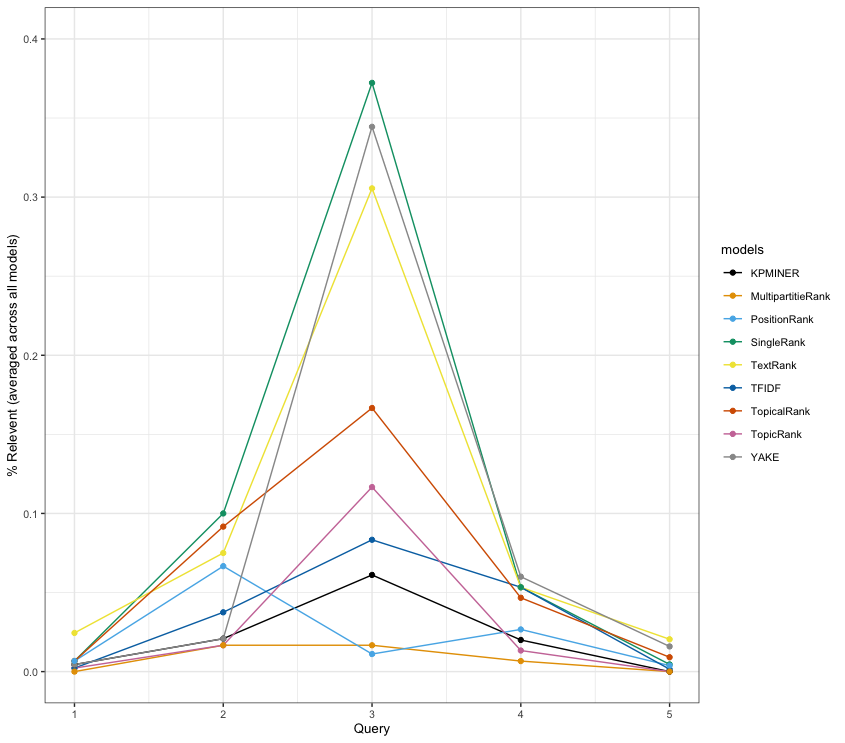
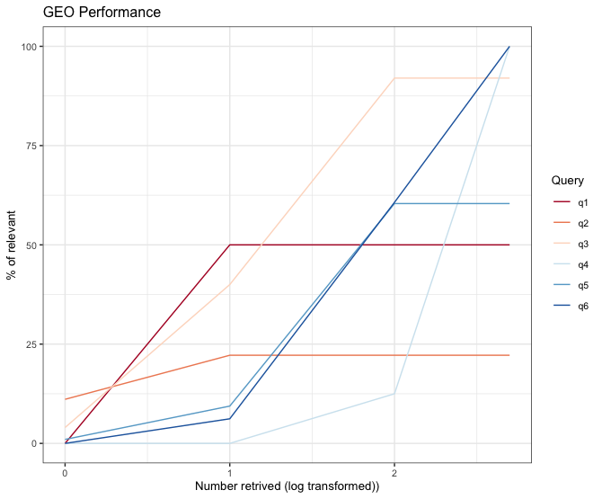

---
author-meta:
- James Wengler
- Stephen R. Piccolo
bibliography:
- content/manual-references.json
date-meta: '2021-11-05'
header-includes: '<!--

  Manubot generated metadata rendered from header-includes-template.html.

  Suggest improvements at https://github.com/manubot/manubot/blob/master/manubot/process/header-includes-template.html

  -->

  <meta name="dc.format" content="text/html" />

  <meta name="dc.title" content="Comparison of keyword-extraction and word-vector generation methods for identifying related genomic datasets" />

  <meta name="citation_title" content="Comparison of keyword-extraction and word-vector generation methods for identifying related genomic datasets" />

  <meta property="og:title" content="Comparison of keyword-extraction and word-vector generation methods for identifying related genomic datasets" />

  <meta property="twitter:title" content="Comparison of keyword-extraction and word-vector generation methods for identifying related genomic datasets" />

  <meta name="dc.date" content="2021-11-05" />

  <meta name="citation_publication_date" content="2021-11-05" />

  <meta name="dc.language" content="en-US" />

  <meta name="citation_language" content="en-US" />

  <meta name="dc.relation.ispartof" content="Manubot" />

  <meta name="dc.publisher" content="Manubot" />

  <meta name="citation_journal_title" content="Manubot" />

  <meta name="citation_technical_report_institution" content="Manubot" />

  <meta name="citation_author" content="James Wengler" />

  <meta name="citation_author_institution" content="Department of Biology, College of Life Sciences, Brigham Young University, Provo, UT, USA" />

  <meta name="citation_author" content="Stephen R. Piccolo" />

  <meta name="citation_author_institution" content="Department of Biology, College of Life Sciences, Brigham Young University, Provo, UT, USA" />

  <meta name="citation_author_orcid" content="0000-0003-2001-5640" />

  <link rel="canonical" href="https://J-Wengler.github.io/NLP_Paper/" />

  <meta property="og:url" content="https://J-Wengler.github.io/NLP_Paper/" />

  <meta property="twitter:url" content="https://J-Wengler.github.io/NLP_Paper/" />

  <meta name="citation_fulltext_html_url" content="https://J-Wengler.github.io/NLP_Paper/" />

  <meta name="citation_pdf_url" content="https://J-Wengler.github.io/NLP_Paper/manuscript.pdf" />

  <link rel="alternate" type="application/pdf" href="https://J-Wengler.github.io/NLP_Paper/manuscript.pdf" />

  <link rel="alternate" type="text/html" href="https://J-Wengler.github.io/NLP_Paper/v/2c71486336fe029975047560c400ec3cb04f9183/" />

  <meta name="manubot_html_url_versioned" content="https://J-Wengler.github.io/NLP_Paper/v/2c71486336fe029975047560c400ec3cb04f9183/" />

  <meta name="manubot_pdf_url_versioned" content="https://J-Wengler.github.io/NLP_Paper/v/2c71486336fe029975047560c400ec3cb04f9183/manuscript.pdf" />

  <meta property="og:type" content="article" />

  <meta property="twitter:card" content="summary_large_image" />

  <link rel="icon" type="image/png" sizes="192x192" href="https://manubot.org/favicon-192x192.png" />

  <link rel="mask-icon" href="https://manubot.org/safari-pinned-tab.svg" color="#ad1457" />

  <meta name="theme-color" content="#ad1457" />

  <!-- end Manubot generated metadata -->'
keywords:
- Natural language processing
- Information retrieval
- Functional genomics
- Keyword extraction
- Machine learning
lang: en-US
manubot-clear-requests-cache: false
manubot-output-bibliography: output/references.json
manubot-output-citekeys: output/citations.tsv
manubot-requests-cache-path: ci/cache/requests-cache
title: Comparison of keyword-extraction and word-vector generation methods for identifying related genomic datasets
...

<small><em>
This manuscript
([permalink](https://J-Wengler.github.io/NLP_Paper/v/2c71486336fe029975047560c400ec3cb04f9183/))
was automatically generated
from [J-Wengler/NLP_Paper@2c71486](https://github.com/J-Wengler/NLP_Paper/tree/2c71486336fe029975047560c400ec3cb04f9183)
on November 5, 2021.
</em></small>

## Authors

+ **James Wengler** 
    · {.inline_icon}
    [J-Wengler](https://github.com/J-Wengler) 
  <small>
     Department of Biology, College of Life Sciences, Brigham Young University, Provo, UT, USA
  </small>

+ **Stephen R. Piccolo** 
    {.inline_icon}
    [0000-0003-2001-5640](https://orcid.org/0000-0003-2001-5640)
    · {.inline_icon}
    [srp33](https://github.com/srp33) 
  <small>
     Department of Biology, College of Life Sciences, Brigham Young University, Provo, UT, USA
  </small>

## Abstract {.page_break_before}

Data-sharing requirements have led to wide availability of genomic datasets in public repositories. Researchers can reuse and combine these datasets to address novel hypotheses. However, after identifying one or more datasets 
that are relevant to a particular research question, a researcher may have difficult identifying other datasets that are also relevant, due to the large quantity of available datasets and lack of structure with which they are described. 
In this study, we focus specifically on Gene Expression Omnibus, a repository that contains genomic data from hundreds of thousands of experiments that is commonly used in biomedical analyses. Notable efforts have been made to manually annotate these data but not been able 
to keep pace as new datasets are submitted. To address this problem, we use natural language processing (NLP). Under the assumption that a researcher has manually identified a subset of available datasets related to a particular 
research topic, we use NLP algorithms to extract keywords from the abstract associated with each dataset. Next we summarize the keywords using diverse embedding algorithms and compare the vectors generated to available datasets to 
identify potential related datasets. 

In terms of word vector generation we test six different models. These models vary in training method, domain, and architecture. The six models are the following: BioWordVec - a FastText model trained on biomedical text, 
FastTextWiki - A FastText model trained on Wikipedia data, FastTextCBOW - a custom FastText model trained on only StarGEO data using the CBOW (continous-bag-of-words) method, FastTextSkipGram - A custom FastText model trained on only
StarGEO data using the SKIPGRAM technique, SciSpaCy - A SpaCy model trained on scientific literature, and SpaCy - A SpaCy model trained with the readily available large web corpus. 

We also test nine keyword extraction methods. Three of the methods are statistical models while the other six are graphical methods. 
The statistical methods are TF-IDF, KP-Miner, and YAKE. TF-IDF works by comparing the frequency of each word found in the passage 
to its frequency in other passages that exist in the corpus. KP-Miner evaluates each word 
based on the context surrounding the words to identify keywords. YAKE combines elements of both TF-IDF and KP-Miner by
using the context while also taking into account the frequency at which the word appears in the document. The first
graphical approach we test is TextRank which is based off of a web technique called PageRank which is used for
identifying related webpages through hyperlinks. TextRank performs a similar analysis with text by creating a graph
where each word is represented as a node. Relationships between words are drawn as connected nodes. These relationships
are used to identify keywords. TopicRank is a process similar to TextRank but the text is preprocessed to create n-grams
of nouns and adjectives as keyphrase candidates before creating a graph with them to identify keywords. SingleRank is
another extension of TextRank with each node having a weight value assigned to it. PositionRank is a more complicated
extension of TextRank where the position of the word within the sentence is assigned a weight along with actual context
as in TextRank. TopicalPageRank is another extension of TextRank that seeks to improve experience by weighting those words
that appear more in the document. The last graphical approach is MultipartiteRank which uses a multipartite graph to construct
the initial graph and calculate weights between nodes. 

We found that different combinations of keyword extraction methods and word vector generation yield very different results. This variety
was also reflected across the query domains. These results show that natural language processing is a powerful tool that can be harnessed
for data collection and more research needs to be done in this area.

## Introduction {.page_break_before}

Natural Language Processing is computational technique that allows computers to process human language [@doi:10.1136/amiajnl-2011-000464].
In the past, Natural Language Processing has been used in several biomedical applications such as concept extraction, electronic health record
analysis, and text mining. [@doi:10.1093/bioinformatics/btz682; @doi:10.1186/s12911-020-01352-2; @doi:10.1007/s40264-018-0762-z]. However there is a lack of research detailing natural language approaches to data collection, specifically the collection of relevant datasets for analysis. A variety of natural language processing models are effective on biomedical literature and several studies have shown their efficacy. In Chiu et al. basic principles of using natural language processing models with biomedical literature are investigated [[@https://aclanthology.org/W16-2922/]. The researchers found that a larger corpus is not necessarily a better corpus and that while the CBOW and Skip-Gram models can be accurately used, CBOW tends to perform better. In Wang et al. several comparisions between training sources for biomedical natural language tasks are studied. The researchers found that there was no singular model best suited for all biomedical natural language processing applications [@doi:10.1016/j.jbi.2018.09.008]. Recently an article was published that details an approach to dataset recommendation using a researchers interests and CV to identify datasets [@doi:10.1093/database/baaa064].
This paper also detailed some difficulties in dataset recommendation. Some of these challenges are a lack of widely-accepted metadata format, lack of available tools, and an exponential rise in available datasets [@doi:10.1093/database/baaa064]. 
In this paper we detail an alternative approach to address this problem using readily available natural language processing tools to identify related datasets from an initial set of related articles. 

The major obstacle to data collection for a researcher is a lack of available tools. The aforementioned paper details an approach to help address
this issue, but is not capable of using a user-generated query to identify related datasets. Another related tool is BioCaddie [@doi:10.1038/ng.3864] which is an ongoing tool to index current datasets to
make them easily searchable. However the advantage to our approach is that it requires no indexing and can be applied to any text-based data.
Our methodology utilises two techniques widely used in natural language processing, namely keyword extraction and word vector generation [@url:https://www.aclweb.org/anthology/C16-2015; @doi:10.1038/s41597-019-0055-0].
Using these two tools, our approach can take several pre-identified datasets and identify other related datasets, no matter how niche the subject area. We test
a variety of these different techniques to identify those that are most promising for future use. 

GEO citation: pubmed:27008011

%%%%%%%%%%%%%%%%%%%%%%%%%%%%%%%%%%%%%%%%%%%%%%%%%%%%%%%%%%%%%%%%%%%%%%%%%%%%%%%%

Data-sharing requirements have led to wide availability of genomic datasets in public repositories. Researchers can reuse and combine these datasets to address novel hypotheses. However, after identifying one or more datasets that are relevant to a particular research question, a researcher may have difficult identifying other datasets that are also relevant, due to the quantity of available datasets and lack of structure with which they are described. In this study, we focus specifically on Gene Expression Omnibus, a repository that contains genomic data from hundreds of thousands of experiments. Notable efforts have been made to manually annotate these data but not been able to keep pace as new datasets are submitted. To address this problem, we use natural language processing (NLP). Under the assumption that a researcher has manually identified a subset of available datasets related to a particular research topic, we use NLP algorithms to extract keywords from the abstract associated with each dataset. Next we summarize the keywords using diverse embedding algorithms. (TODO: I'm sure there's a better way to say this.)

TODO: Describe briefly here about the theoretical approaches that we compared more so than the specific software packages. Without making it too long, make sure to cover all of the approaches.

Concerning word vector generation we test two primary factors, domain and training algorithm. Domain refers to the type of text that each model is trainined on. We compare biomedical specific text (StarGEO abstracts) with readily available models trained on wikipedia data. Once a domain has been identified there are two options for training algorithms. The first is continous-bag-of-words (CBOW). CBOW trains by predicting the target word from the context words that surround it. The second option is skip-gram. Skip-gram trains by predicting the context words from the target word essentially the reverse of CBOW.

We test nine keyword extraction methods. Three of the methods are statistical models while the other six are graphical methods. The statistical methods are TF-IDF, KP-Miner, and YAKE. TF-IDF works by comparing the frequency of each word found in the passage to its frequency in other passages that exist in the corpus. KP-Miner evaluates each word based on the context surrounding the words to identify keywords. YAKE combines elements of both TF-IDF and KP-Miner by using the context while also taking into account the frequency at which the word appears in the document. The first graphical approach we test is TextRank which is based off of a web technique called PageRank which is used for identifying related webpages through hyperlinks. TextRank performs a similar analysis with text by creating a graph where each word is represented as a node. Relationships between words are drawn as connected nodes. These relationships are used to identify keywords. TopicRank is a process similar to TextRank but the text is preprocessed to create n-grams of nouns and adjectives as keyphrase candidates before creating a graph with them to identify keywords. SingleRank is another extension of TextRank with each node having a weight value assigned to it. PositionRank is a more complicated extension of TextRank where the position of the word within the sentence is assigned a weight along with actual context as in TextRank. TopicalPageRank is another extension of TextRank that seeks to improve experience by weighting those words that appear more in the document. The last graphical approach is MultipartiteRank which uses a multipartite graph to construct the initial graph and calculate weights between nodes.

We found that different combinations of keyword extraction methods and word vector generation yield very different results. This variety was also reflected across the query domains. These results show that natural language processing is a powerful tool that can be harnessed for data collection and more research needs to be done in this area.

## Methods {.page_break_before}

### Annotated data collection

As a reference standard, we used annotations from Search Tag Analyze Resource for GEO (STARGEO)[@doi:10.1038/sdata.2017.125]. For STARGEO, biomedical graduate students manually curate sample metadata and assign tags to GEO Series. We used these annotations to identify Series that had been associated with a given phenotype. To represent different types of queries that researchers might perform in GEO, we searched for human phenotypes that would result in a small, medium, or large number of GEO Series. We also sought to represent diverse phenotypic categories. On March 9 2021, we identified two phenotypes with approximately 100 Series, two with approximately 20 Series, and two with fewer than 10 Series[Table @tbl:query-summary]. (Because STARGEO is an ongoing project, it is likely that additional articles will be associated with these tags over time.) For each GEO Series, we used the STARGEO application programming interface[@url:http://STARGEO.org/api_docs/] to download the associated abstract, title, and accession number.

| *STARGEO tag(s)*               | *Number of GEO Series*  |
|:-------------------------------|------------------------:|
| Family History + Breast Cancer |                       6 |
| Liver Damage + Hepatitis       |                       9 |
| Monozygotic Twins              |                      25 |
| Kidney + Tumor + Cell Line     |                      16 |
| Diabetes + Type 1              |                      97 |
| Osteosarcoma                   |                     112 |

Table: STARGEO tags associated with phenotype searches and the number of GEO Series returned per search. {#tbl:query-summary}

### Manual queries

As a baseline, we evaluated our ability to identify GEO Series relevant to a particular phenotype using the GEO DataSets Advanced Search Builder. This analysis was performed on March 24, 2021. To maintain consistency with STARGEO, we entered the same keywords that we used in STARGEO and limited the results to GEO Series (no SuperSeries) and human data. We also limited the search results to Series that were available in STARGEO's corpus at that time. The Advanced Search Builder sometimes expanded our query terms and mapped them to the MeSH terminology. For example, our search that used the terms "Family History" and "Breast Cancer" was expanded to ("medical history taking"[MeSH Terms] OR Family History[All Fields]) AND ("breast neoplasms"[MeSH Terms] OR Breast cancer[All Fields]).

### Keyphrase extraction

For each abstract, we sought to identify *n* keyphrases that would most effectively characterize the semantic meaning of the abstract. In our benchmark comparisons, we used *n* values of 10, 20, and 30 and applied 9 unsupervised, keyphrase-extraction techniques that had been implemented in the *pke* Python module[https://aclanthology.org/C16-2015/]. The keyphrase-extraction techniques were TFIDF[@https://ieeexplore.ieee.org/abstract/document/5392697;@https://www.emerald.com/insight/content/doi/10.1108/eb026526/full/html], KP-Miner[@http://www.aclweb.org/anthology/S10-1041.pdf], YAKE[@https://doi.org/10.1016/j.ins.2019.09.013], TextRank[@http://www.aclweb.org/anthology/W04-3252.pdf], SingleRank[@http://www.aclweb.org/anthology/C08-1122.pdf], TopicRank[@https://aclweb.org/anthology/I13-1062.pdf], TopicalPageRank[@http://users.intec.ugent.be/cdvelder/papers/2015/sterckx2015wwwb.pdf], PositionRank[@http://www.aclweb.org/anthology/P17-1102.pdf] and MultipartiteRank[https://arxiv.org/abs/1803.08721]. 

### Word-vector models

Using keyphrases from each abstract, we generated word vectors---numeric representations of text---based on models that had previously been trained on large amounts of unlabeled text. We generated the word vectors using the *fastText* (version 0.9.2) and *spaCy* (version 2.3.0) open-source libraries [@url:https://spacy.io;@arxiv:1902.07669;@arXiv:1607.04606], which both have been used widely in biomedical applications [@doi:10.1038/s41598-019-47046-2; @doi:10.1186/s12859-018-2496-4; @doi:10.18653/v1/W16-2922]. fastText provided two approaches for generating word vectors: Skip-gram and Continuous-Bag-Of-Words (CBOW). Given a particular word (or subword), the Skip-gram method trains a neural network to predict surrounding (sub)words; the weights of the network's hidden layer are used in the word vector. The CBOW method uses a similar approach but attempts to predict a (sub)word of interest, given a fixed-size window of surrounding (sub)words. For spaCy, we used named-entity recognition models with tokenized, hashed representations constructed from word features[@https://arxiv.org/pdf/1902.07669.pdf]. We generated a word vector for each keyphrase, summed the vectors for a given abstract, and then divided by the number of keywords in the abstract (so that results would be comparable when using different numbers of keywords). This technique has been shown to be a simple and effective way to combine multiple embeddings into a single vector and is often used to generate document-level embeddings [@url:http://arxiv.org/abs/1607.05368].
%https://towardsdatascience.com/word2vec-skip-gram-model-part-1-intuition-78614e4d6e0b

%"FastText [8] expresses a word by the sum of the N-gram vector of the character level. The embedding method at the subword level solves the disadvantages that involve difficulty in application to languages with varying morphological changes or low frequency. This method was strong at solving the OOV problem, and accuracy was high for rare words in the word set. BioWordVec [9] learns clinical record data from PubMed and MIMIC-III clinical databases using fastText. Based on 28,714,373 PubMed documents and 2,083,180 MIMIC-III clinical database documents, the entire corpus was built. The Medical Subject Headings (MeSH) term graph was organized to create a heading sequence and to carry out word embedding based on a sequence combining MeSH and PubMed. BioWordVec provided a 200-dimensional pretrained word embedding matrix"

### Training corpora

We used models trained on English-language text from diverse sources. We used a *BioWordVec* model[@pubmed:31076572] that had been trained on PubMed abstracts and clinical notes from the MIMIC-III database[@https://www.nature.com/articles/sdata201635] (downloaded from https://ftp.ncbi.nlm.nih.gov/pub/lu/Suppl/BioSentVec/). This model used 100-dimensional vectors. We used a *fastTextWiki* model that had been trained on n-gram representations of articles from Wikipedia and news sources, representing diverse topics as of 2017; this model used 300-dimensional vectors and the CBOW (Continous-bag-of-words) method. We trained a *fastTextSkipGram* model on all available abstracts from GEO Series (as of March 2021) representing diverse types of human disease; the vectors in this model were 300-dimensional and were generated using the Skip-gram method. The *fastTextCBOW* model was identical to the *fastTextSkipGram* model except that we used CBOW to generate the vectors. The *SpacyWebLG* model had been trained on written text from blogs, news, and comments from diverse websites. The *SciSpacy* model[https://arxiv.org/abs/1902.07669] had been trained on text from the BioCreative V CDR (BC5CDR) task corpus, comprising chemical, disease, and chemical-disease annotations from 1500 PubMed articles[https://pubmed.ncbi.nlm.nih.gov/27161011/]. *SciSpacy* uses a 200-dimensional vector while *SpacyWebLG* utilizes a 300-dimensional vector.
%Training these models was accomplished by using the trainFastTextModel function found in analysis/Python_Scripts/helper.py. 

### Model Evaluation 
 
We tested each combination of phenotype query, keyword-extraction technique, number of keywords, and word-vector generation method. For each combination, we completed the following steps.

1. Randomly selected 1000 GEO Series identifiers from those available in STARGEO. (We used the same 1000 Series for all combinations to ensure fair comparisons.)
2. Added the 265 GEO Series identifiers associated with all of the phenotype queries (Table X). (This raised the total number of Series to 1265).
3. Randomly assigned approximately half of the Series as training instances and the remaining half as test instances.
4. Retrieved the abstract associated with each Series.
5. Extracted *n* keywords from the abstract using a given keyword-extraction technique.
6. Loaded the word-vector model and extracted a vector for each training instance.
7. Combined all training vectors by adding them in a vector-wise manner and then dividing the resulting vector by the number of Series in the training dataset. This resulted in a single training vector per phenotype.
8. Used the cosine similarity to estimate the similarity between each test instance and the training vector associated with a given phenotype. This method calculated the cosine of the angle drawn between the two vectors in a multi-dimensional space.
9. Calculated the proportion of the top 1, 10, and 100 test instances that STARGEO had previously identified as being relevant to the phenotypic category.

### Code availability

All code that we used to perform this analysis have been deposited on GitHub (https://github.com/J-Wengler/NLP_Paper). To facilitate reproducibility, the analysis is executed within a Docker container[@doi:10.1145/2723872.2723882]. We used version 3.8.5 of the Python programming language (https://python.org).

## Results {.page_break_before}

TODO: analysis/Data/GEO_Queries/geo_results is a summary file indicating the accuracy achieved by this manual result. A result graph is also available in the appendix.

TODO: To demonstrate the variance among keyword extraction techniques, we compared the top three keywords returned from a test abstract by each different keyword extraction method. The test abstract and results are available in the appendix.

### Keyword Identification

Keyword extraction is a vital part of the analysis. There are a variety of techniques to achieve this, and we test the most common 9 techniques in this paper. Each technique performs the analysis slightly differently and this leads to variation in the keywords identified.  An example of the variation is shown below.

*Sample Abstract -> "BRCA1 and BRCA2 are the genes related with breast and ovarian cancer. They have function in DNA repair processes and thus they are tumor suppressor genes. There are hundreds of mutations identified in these genes. Functional deficiencies due to these mutations impair DNA repair and cause irregularities in the DNA synthesis. The standard method for the laboratory assessment of these BRCA genes includes comprehensive sequencing and testing of broad genomic rearrangements. Members of the families with BRCA mutations have an increased risk for early onset of breast cancer and ovarian cancer occurring at any age."*

| *Keyword Extraction Technique* | *Top 3 Keywords returned* |
|:-------------------------------|:-------------------------:|
| TopicRank                         | 'mutations', 'breast', 'dna repair processes'                               |
| TextRank                          | 'dna repair processes', 'tumor suppressor genes', 'serum ca-125 levels'     |
| SingleRank                        | 'brca mutations', 'brca genes', 'breast cancer'                             |
| TopicalPageRank                   | 'brca genes', 'brca mutations', 'tumor suppressor genes'                    |
| MultipartiteRank                  | 'mutations', 'genes', 'dna repair processes'                                |

%### Word Vector Generation
%
%Vector generation is how similarities between articles are calculated. This allows us to give a numerical percentage to quantify the relationship between two datasets. In our analysis we test 6 models that can generate vectors. Each model is trained on unique text and will yield slightly different word vectors. This in turn will generate slightly different cosine similarities. An example of vector generation is shown below:

%| *Word* | *Vector* |
%|:-------|:--------:|
%| Database | [ 1.3863622   1.0939984  -2.1352     -1.9841313  -0.31141075  1.3959851 ... ]  |
%| Gene     | [ 1.4969006   2.7855976  -4.313326   -2.5572329  -0.9275282   0.43499815 ... ] |
%| Mutation | [ 2.7130241e+00  2.5561374e-01 -2.1098554e+00 -2.1719341e+00 ... ]             |
%| Disease  | [ 1.9606729e+00  3.5872436e-01 -2.9315462e+00 -2.3048987e+00 ... ]             |

### Evaluation Results

##### Effect of Number of Keywords Returned on the Percentage of Relevent Articles Returned at 100 Articles
{width="7in" height = "7in"}
This summary graph shows the relationship between the number of keywords queried and percentage of relevant articles returned at 100 articles. Between the three groups a wilcoxon test found no signficant difference.

##### 30 keywords
This graph is an example of a graph generated by the AllGraphs script in /images/. All other models
are contained in the appendix. This graph is 30 keywords using the SciSpaCy model. 
{width="7in" height = "7in"} 

##### GEO Results
This graph contains the manual Gene Expression Omnibus results.
{width="7in" height = "7in"}

## Discussion {.page_break_before}

#### Overview
The purpose of this project was to illustrate the usage of Natural Language Processing in the data collection phase of any project and to identify techniques to use
in future projects. NLP has already been shown to be useful to find related articles of scientific nature 
[@doi:10.3389/frma.2019.00002; @url:http://arxiv.org/abs/2006.01131; @doi:10.1038/d41586-020-03277-2]. However to our knowledge no project has been done comparing 
word vector generation and keyword extraction techniques for usage in data collection. This is addressed in our paper in the head to head comparision of these techniques. 
We hope this will further our knowledge as to how natural language processing might help researchers in future studies. 

#### Motivation
This project was motivated through our personal experiences attempting to find datasets. Often as researchers a project will began as a big picture idea and the first step 
is the collection of related datasets to further narrow the project idea. This step can be time-consuming and frustrating due to the lack of tools available and the massive
amount of data that exists. Existing tools are limited by user-provided queries that may not be precise. Existing tools such as the search function of Gene Expression Omnibus
that take user generated queries are often limited by the exact phrasing of the query. For example the query "mohs" returns 100 results but "moh's" returns 33 different results.
Experiences like this motivated us to look for a technique that could use a dataset to identify related datasets free of human-generated queries. 

#### Reduced Set Testing
The results contained within this paper are from a reduced set of all STARGEO articles (266) plus an additional 1000 randomly queried articles from GEO. The purpose for performing the reduced set was the full 41,823 article corpus from STARGEO ran for over one month and we were not able to complete the full testing. A reduced corpus of 1000 articles allowed us to compare the various methods head to head without the need for extensively long wait times. However the analysis is set up in such a way as to allow the researcher to easily change the amount of articles used in the analysis. 

[TODO: Which heading would this fall best under? A new one? I lean towards adding it to the motivation section]
The source of the training data is an important aspect of generating word vectors. Recent literature supports using training data from a research domain that matches the domain of the testing data [@doi:10.18653/v1/W16-2922]. However, the benefits of using domain-specific training data remain under question [@doi:10.1016/j.jbi.2018.09.008]. Training on a larger corpus that is not domain specific might be more effective than training on a smaller corpus that is domain specific due to its ability to cover a broader set of word vectors. 

#### Observations
The results show a wide variety of accuracy across the queries. This pattern of the same natural language processing technique 
giving disparate results on intrinsic evaluations is one commonly seen in natural language processing evaluations 
[@doi:10.1371/journal.pone.0220976; @doi:10.1038/s41597-019-0055-0; @url:https://arxiv.org/abs/1607.05368]. However the results do show a pattern
that the best performing results are when the model and data are similar. Another interesting observation is the varying results between queries. 
The best performing queries are consistently queries one and two which are the smalled queries with six and nine results respectively. This would imply
that the more narrowly defined a query, the better this technique can perform. 

The amount of keywords does not impact the percentage of relevant articles returned. This is likely due to the fact that 10 keywords is sufficient to capture
the meaning of the query. Adding more keywords only adds irrelevant noise to the model. 

#### Practical Utility
Our results show a practical utility for this technique to a researcher who is interested in a very specific knowledge base. If a researcher
has previously identified several articles that deal with a narrowly defined subject area, using this technique to query a larger database (not StarGEO) would result in the 
discovery of potentially all the related datasets that exist in that database. Using this technique, the researcher can bypass the arduous process of collecting datasets and 
trying to determine which are useful. This technique can also be used to look at multiple datasets within in a broad context. While not useful for potentially finding a niche
dataset from a broad query, the ability of this technique to find even distantly related dataset could be used to facilitate a broad understanding of the datasets related to
a concept. 

It is important to note that this is not a well-polished tool free of bugs. This is a proof of concept that can be applied in various situations to yield useful results. Any 
customization would require the manual editing of the code to fit the use cause.

#### Limitations
There are several limitations to our approach. Most obvious is a lack of methods to compare it against. There exists no other tool for gathering related datasets from an intial cohort
of datasets. This means that the only external evaluation possible is to compare it to hand curation of datasets by other researchers. We did consider this option but rejected it due 
to the subjective nature of human curation and the time it would require of the participants. There are also other keyword extraction and word vector generation techniques. Our keyword 
extraction techniques were limited to those available in the PKR Python package to ensure consistency. Word vectors were limited to the those that were most commonly tested and available
in other NLP related papers [@doi:10.1016/j.jbi.2018.09.008; @url:http://arxiv.org/abs/1806.02901]. Further testing is warranted on less known models and techniques.
 
All analysis were performed on a Dell PowerEdge R730xd server with two Intel Xeon E5-2640 v4 2.4GHz CPUs that each support 10 cores with two threads apiece with a total of 256gb of RAM. All analyses were run using the Multiprocessing
package that allowed each combination of keyword extraction and word vector to each be run as a separate task. This hardware was not capable of running the full analysis even using the multiprocessing package. We hypothesis this is due
to the relatively long time it takes to generate a word vector. 

Why we used different word-vector lengths...

## Appendix {.page_break_before}

### Comparison of Keywords Techniques
Test Abstract from PubMed. [@doi:10.2337/db11-1549]
Text = "OBJECTIVE: Novel biomarkers of disease progression after type 1 diabetes onset are needed. RESEARCH DESIGN AND METHODS: We profiled peripheral blood (PB) monocyte gene expression in 6 healthy subjects and 16 children with type 1 diabetes diagnosed ~3 months previously, and analyzed clinical features from diagnosis to 1 year. RESULTS: Monocyte expression profiles clustered into two distinct subgroups, representing mild and severe deviation from healthy controls, along the same continuum. Patients with strongly divergent monocyte gene expression had significantly higher insulin dose-adjusted HbA1c levels during the first year, compared to patients with mild deviation. The diabetes-associated expression signature identified multiple perturbations in pathways controlling cellular metabolism and survival, including endoplasmic reticulum and oxidative stress (e.g. induction of HIF1A, DDIT3, DDIT4 and GRP78). qPCR quantitation of a 9-gene panel correlated with glycaemic control in 12 additional recent-onset patients. The qPCR signature was also detected in PB from healthy first-degree relatives. CONCLUSIONS: A PB gene expression signature correlates with glycaemic control in the first year after diabetes diagnosis, and is present in at-risk subjects. These findings implicate monocyte phenotype as a candidate biomarker for disease progression pre- and post-onset, and systemic stresses as contributors to innate immune function in type 1 diabetes."

| *Keyword Extraction Technique* | *Keywords Returned* |
|:-------------------------------|:-------------------:|
| TopicRank        | "monocyte gene expression", "diabetes onset", "year"                                             |
| TextRank         | "divergent monocyte gene expression", "monocyte gene expression", "pb gene expression signature" |
| SingleRank       | "pb gene expression signature", "divergent monocyte gene expression", "monocyte gene expression" |
| TopicalPageRank  | "pb gene expression signature", "divergent monocyte gene expression", "monocyte gene expression" |
| MultipartiteRank | "monocyte gene expression", "diabetes onset", "type"                                             |

##### 30 Keywords
{width="7in" height = "7in"} 
{width="7in" height = "7in"} 
{width="7in" height = "7in"} 
{width="7in" height = "7in"} 
{width="7in" height = "7in"} 
{width="7in" height = "7in"} 

## References {.page_break_before}

<!-- Explicitly insert bibliography here -->

